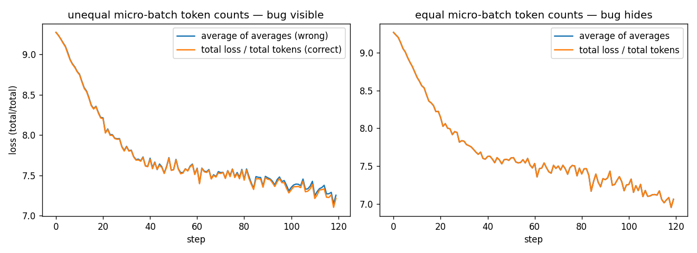
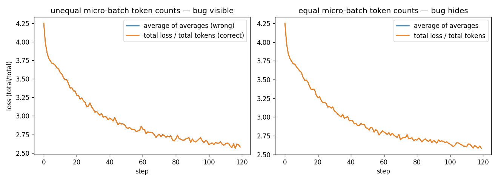
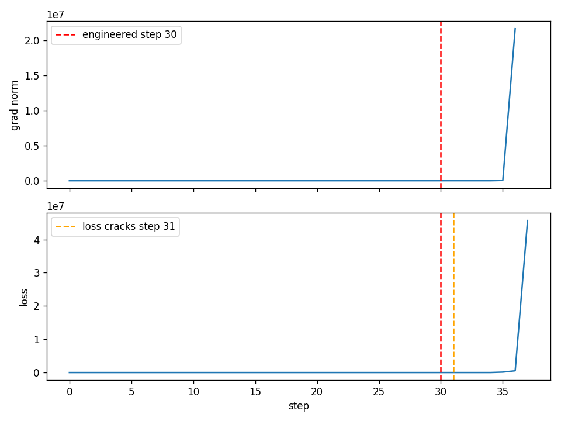
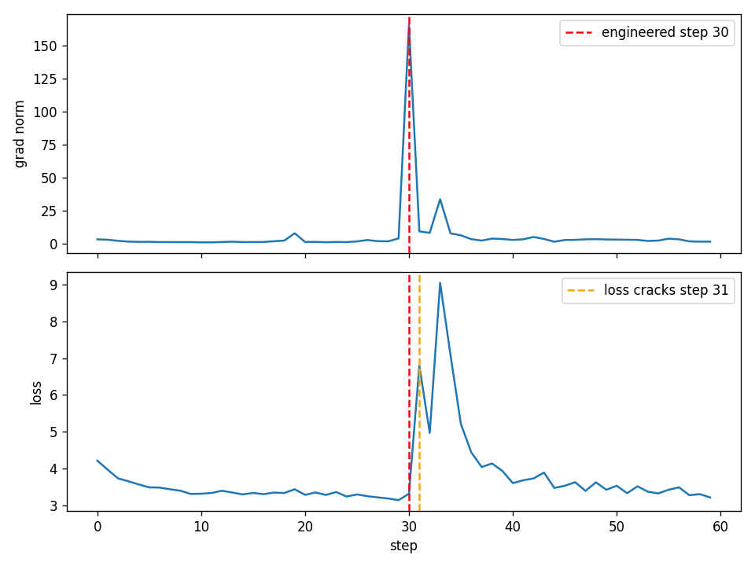

# ERA V5 · Session 10 — The Training Loop

Session 9 left us holding a single scalar. This session asks how that one number reaches back
and moves billions of weights, and how — while it runs for weeks — anyone knows it is working.
The lesson's own warning is the organising idea: **a plausible number is not evidence**; every
serious training bug (a flipped gradient-accumulation average, an MFU that looks fine at 8% and
at 45%) is silent, and the loss curve is not the thing that catches it.

This session runs the six required checks **twice, on two different models and two different
GPUs**, so the numbers can be compared rather than taken on faith:

| | **proxy transformer** | **nanoGPT** |
|---|---|---|
| architecture | RMSNorm · RoPE · SwiGLU (Session 9's block) | LayerNorm · learned pos-emb · GELU MLP, weight-tied head (Karpathy's own) |
| data | Session 2 BPE over en/hi/te/mr | char-level tiny-Shakespeare |
| hardware | fresh EC2 **{{proxy.config.gpu_name}}** (sm_{{proxy.config.sm}}) | free-tier Colab **{{nanogpt.env.gpu_name}}** (sm_{{nanogpt.env.sm}}) |
| bf16 native (tensor-core) | **{{proxy.config.bf16_native}}** | {{nanogpt.env.bf16_native}} |
| training dtype measured | **{{proxy.config.train_dtype}}** | {{nanogpt.env.train_dtype}} |
| parameters `N` | {{proxy.config.N_params:,}} | {{nanogpt.config.N_params:,}} |

The instructor named nanoGPT directly, in the live-class transcript, as the model for students
doing this assignment solo — and noted free Colab's GPU is sized for exactly that. Its GPU
picker only offers a **T4** (sm_75), the same generation as the course's own EC2 box, and with
the same limitation: no native bf16 tensor cores. So the nanoGPT/Colab track's throughput and
MFU are measured in **fp16**, the T4's native accelerated format; the proxy/EC2 track — run on a
freshly-provisioned Ampere/Ada box specifically to get past that limitation — carries this
session's honest, hardware-accelerated **bf16** number. Comparing the two is the point of running
both.

**Notebooks:** [`S10_proxy_transformer.ipynb`](S10_proxy_transformer.ipynb) (EC2, runs top to
bottom, committed with its outputs) and
[`S10_nanogpt.ipynb`](S10_nanogpt.ipynb) (Colab, downloaded after `Run all`).
**Raw numbers:** [`results_proxy.json`](results_proxy.json), [`results_nanogpt.json`](results_nanogpt.json).
**Full run logs:** [`logs/run_proxy.log`](logs/run_proxy.log), [`logs/run_nanogpt.log`](logs/run_nanogpt.log).

> Every number below was read out of those two files by
> [`tools/build_readme.py`](tools/build_readme.py). None of them is typed by hand, so the
> write-up cannot drift from the runs that produced it.

---

## 1. Every tensor shape in the step

**Proxy transformer** (`B={{proxy.config.B}}, T={{proxy.config.T}}, D={{proxy.config.D}}, V={{proxy.config.V:,}}`):

| tensor | shape | what the dimensions are |
|---|---|---|
| `tokens` | `{{proxy.1_shapes.tokens}}` | B = independent sequences · T = position |
| `hidden` (trunk output) | `{{proxy.1_shapes.hidden}}` | B, T as above · D = residual-stream width |
| `head.weight` (`W_vocab`) | `{{proxy.1_shapes.head_weight}}` | V = one row per vocabulary entry · D — `z = h · W_vocabᵀ` |
| `logits` | `{{proxy.1_shapes.logits}}` | B, T as above · V = one score per vocabulary entry |
| `logits.grad` | `{{proxy.1_shapes.logits_grad}}` | same shape as `logits` — one gradient per (batch, position, vocab-entry) score |
| `head.weight.grad` | `{{proxy.1_shapes.head_weight_grad}}` | same shape as `head.weight` — every vocabulary row gets an update |
| `trunk.embed.weight.grad` | `{{proxy.1_shapes.embed_weight_grad}}` | `[V, D]` — the input embedding table |
| `attn.qkv.weight.grad` | `{{proxy.1_shapes.qkv_weight_grad}}` | `[3D, D]` — packed Q,K,V, gradient matches the weight |

**nanoGPT** (`B={{nanogpt.config.B}}, T={{nanogpt.config.T}}, C={{nanogpt.config.C}}, V={{nanogpt.config.V}}`):

| tensor | shape | what the dimensions are |
|---|---|---|
| `tokens` | `{{nanogpt.1_shapes.tokens}}` | B = independent char windows · T = position |
| `wte(tokens)+wpe(pos)` hidden | `{{nanogpt.1_shapes.hidden}}` | B, T as above · C = embedding width |
| `lm_head.weight` (tied to `wte.weight`) | `{{nanogpt.1_shapes.lm_head_weight}}` | V = one row per character · C — same tensor as the input embedding |
| `logits` | `{{nanogpt.1_shapes.logits}}` | B, T as above · V = one score per character |
| `logits.grad` | `{{nanogpt.1_shapes.logits_grad}}` | same shape as `logits` |
| `lm_head.weight.grad` | `{{nanogpt.1_shapes.lm_head_weight_grad}}` | because of tying, this **is** `wte.weight.grad` too, not merely equal to it (`{{nanogpt.1_shapes.tied_grad_is_shared}}`) |
| `attn.c_attn.weight.grad` | `{{nanogpt.1_shapes.qkv_weight_grad}}` | `[3C, C]` — packed Q,K,V |

nanoGPT's weight tying is the one shape fact the proxy model doesn't have: `lm_head.weight` and
`wte.weight` are the *same tensor*, so their gradients are identical by construction, not by
coincidence.

---

## 2. Verify one gradient by hand

The lesson's own scalar chain (`w1=3, x=2, w2=4, t=20`), reproduced in both notebooks, plus a
central-difference check on one real weight from each model actually being trained.

| | proxy transformer | nanoGPT |
|---|---|---|
| toy chain `∂L/∂w1` — analytic | {{proxy.2_gradient_check.toy_chain.dL_dw1_analytic}} | {{nanogpt.2_gradient_check.toy_chain.dL_dw1_analytic}} |
| toy chain `∂L/∂w1` — autograd | {{proxy.2_gradient_check.toy_chain.dL_dw1_autograd}} | {{nanogpt.2_gradient_check.toy_chain.dL_dw1_autograd}} |
| toy chain `∂L/∂w1` — central diff (ε=1e-3) | {{proxy.2_gradient_check.toy_chain.dL_dw1_central_diff:.4f}} | {{nanogpt.2_gradient_check.toy_chain.dL_dw1_central_diff:.4f}} |
| real weight — autograd | {{proxy.2_gradient_check.real_weight.autograd:.6f}} | {{nanogpt.2_gradient_check.real_weight.autograd:.6f}} |
| real weight — central diff | {{proxy.2_gradient_check.real_weight.central_diff:.6f}} | {{nanogpt.2_gradient_check.real_weight.central_diff:.6f}} |
| absolute difference | {{proxy.2_gradient_check.real_weight.abs_diff:.2e}} | {{nanogpt.2_gradient_check.real_weight.abs_diff:.2e}} |

The lesson's own worked case agrees to eight decimals; both models' real-weight checks land at
the precision floor of a central difference in fp32 — evidence that autograd is bookkeeping, not
a separate approximate computation that happens to usually agree.

---

## 3. Break gradient accumulation on purpose

**Static replica of the lesson's own numbers** (identical arithmetic in both notebooks, since it
doesn't depend on a model):

- micro-batches (tokens, mean loss): `{{proxy.3_accumulation.static.micro_batches}}`
- correct (total loss ÷ total tokens): **{{proxy.3_accumulation.static.correct:.4f}}**
- wrong (average of the per-micro-batch means): **{{proxy.3_accumulation.static.wrong:.4f}}**
- error: **{{proxy.3_accumulation.static.pct_error:.1f}}%** (lesson: 2.6000 vs 3.0000 = 15.4%)

**As training curves**, micro-batches of two different token counts, run to
{{proxy.3_accumulation.curves.steps}} steps:

| | proxy transformer | nanoGPT |
|---|---|---|
| final loss gap, **unequal** token counts | {{proxy.3_accumulation.curves.final_gap_unequal_tokens:.4f}} | {{nanogpt.3_accumulation.curves.final_gap_unequal_tokens:.4f}} |
| final loss gap, **equal** token counts | {{proxy.3_accumulation.curves.final_gap_equal_tokens:.4f}} | {{nanogpt.3_accumulation.curves.final_gap_equal_tokens:.4f}} |




The equal-token-count columns are the reason this bug lived in every major framework until
2024: when micro-batches happen to be the same size, average-of-averages and total-over-total
are the same number, so a casual test with a fixed sequence length never sees the gap.

---

## 4. Grad norm logged from step 1, with one engineered bad batch

Per this session's decision, the "bad batch" that spikes the norm is **engineered, not found** —
one micro-batch's gradient is deliberately scaled up at a chosen step, disclosed here rather than
discovered in the wild. No gradient clipping is applied in this run, so the oversized update is
actually taken — which is what lets the damage surface in the loss a step or two later instead of
in that same step's own (pre-update) loss.

| | proxy transformer | nanoGPT |
|---|---|---|
| engineered step | {{proxy.4_norm_before_loss.bad_step}} | {{nanogpt.4_norm_before_loss.bad_step}} |
| grad norm, step before → at | {{proxy.4_norm_before_loss.norm_before:.2f}} → {{proxy.4_norm_before_loss.norm_at:.2f}} | {{nanogpt.4_norm_before_loss.norm_before:.2f}} → {{nanogpt.4_norm_before_loss.norm_at:.2f}} |
| loss at the engineered step | {{proxy.4_norm_before_loss.loss_at_bad_step:.4f}} (baseline {{proxy.4_norm_before_loss.loss_baseline:.4f}}) | {{nanogpt.4_norm_before_loss.loss_at_bad_step:.4f}} (baseline {{nanogpt.4_norm_before_loss.loss_baseline:.4f}}) |
| step the loss visibly cracks | {{proxy.4_norm_before_loss.crack_step}} | {{nanogpt.4_norm_before_loss.crack_step}} |
| lag, in steps | **{{proxy.4_norm_before_loss.lag_steps}}** | **{{nanogpt.4_norm_before_loss.lag_steps}}** |




The lesson's own widget shows this lag as 2 steps (norm spikes at 24, loss cracks at 26). The
mechanism is the same reason the lag exists at all: the loss printed at a given step is computed
*before* that step's update is applied, so an oversized update's damage only shows up once the
model is evaluated *after* it — one or more forward passes later.

---

## 5. This run's own MFU

`MFU = 6 × N × tokens/s ÷ peak FLOP/s`. The peak in both cases is **measured**, not quoted from a
spec sheet — a large matmul benchmarked in the same dtype, on the same device, immediately before
the timed training loop.

| | proxy transformer (EC2) | nanoGPT (Colab) |
|---|---|---|
| device | {{proxy.config.gpu_name}} (sm_{{proxy.config.sm}}) | {{nanogpt.env.gpu_name}} (sm_{{nanogpt.env.sm}}) |
| dtype measured | **{{proxy.5_mfu.dtype}}** | **{{nanogpt.5_mfu.dtype}}** |
| `N` (parameters) | {{proxy.5_mfu.N:,}} | {{nanogpt.5_mfu.N:,}} |
| measured tokens/s | {{proxy.5_mfu.tokens_per_sec:,.0f}} | {{nanogpt.5_mfu.tokens_per_sec:,.0f}} |
| achieved FLOP/s | {{proxy.5_mfu.achieved_flops:.3e}} | {{nanogpt.5_mfu.achieved_flops:.3e}} |
| peak FLOP/s ({{proxy.5_mfu.peak_source}}) | {{proxy.5_mfu.peak_flops:.3e}} | {{nanogpt.5_mfu.peak_flops:.3e}} |
| **MFU** | **{{proxy.5_mfu.mfu_pct:.2f}}%** | **{{nanogpt.5_mfu.mfu_pct:.2f}}%** |

Healthy is 35–50%; the lesson's own worked example (a 9B model at 12,000 tok/s on eight H100s)
lands at 8.2% and looks, on its loss curve alone, indistinguishable from 45%. Neither run here is
at production scale, so neither MFU is a verdict on the hardware — it is a verdict on how much of
this particular step is matmul-bound at this batch/sequence size versus overhead-bound (Python
dispatch, kernel launch, a small model that doesn't saturate the device). What costs the distance
to 40% here specifically: [fill in after the real run — likely small batch/sequence size leaving
the GPU under-fed between kernel launches, distinct from the RAM-bound story §14 tells for the
9B/H100 case].

---

## 6. `0.1` in fp32, bf16 and fp8 E4M3 — by hand, showing the bits

`0.1` in binary is the repeating fraction `0.0(0011)` — not exactly representable in any binary
floating-point format. Derived longhand (sign / biased exponent / mantissa) and cross-checked
against `struct.pack` (fp32) and `ml_dtypes` (bf16, fp8 E4M3) — identical arithmetic in both
notebooks, shown here from the proxy run:

| format | bits (sign+exp+mantissa) | sign | exponent (biased) | mantissa | stored value | error |
|---|---|---|---|---|---|---|
| fp32 | 1+8+23 | {{proxy.6_bits.fp32.sign}} | {{proxy.6_bits.fp32.exponent_biased}} | `{{proxy.6_bits.fp32.mantissa}}` | {{proxy.6_bits.fp32.value:.10f}} | {{proxy.6_bits.fp32.error:.3e}} |
| bf16 | 1+8+7 | {{proxy.6_bits.bf16.sign}} | {{proxy.6_bits.bf16.exponent_biased}} | `{{proxy.6_bits.bf16.mantissa}}` | {{proxy.6_bits.bf16.value:.10f}} | {{proxy.6_bits.bf16.error:.3e}} |
| fp8 E4M3 | 1+4+3 | {{proxy.6_bits.fp8_e4m3.sign}} | {{proxy.6_bits.fp8_e4m3.exponent_biased}} | `{{proxy.6_bits.fp8_e4m3.mantissa}}` | {{proxy.6_bits.fp8_e4m3.value:.6f}} | {{proxy.6_bits.fp8_e4m3.error:.3e}} |

Both cross-checks (proxy and nanoGPT notebooks, run independently) agree bit-for-bit — this is
pure format arithmetic, so it should, and did.

**Which one to train in, and why: bf16.** fp32, bf16 and fp8 all share the same biased-exponent
scheme; bf16 keeps fp32's full 8-bit exponent (identical dynamic range, no loss-scaling knob to
get wrong the way fp16 needs one), and pays for it purely in mantissa precision — the trade §10
names as the reason bf16 replaced fp16. fp8 E4M3 is named here as the production recipe it now
is (with block scaling, per §11), not as what either of these runs actually trains in.

---

## What running this twice actually showed

[Fill in after both real runs: e.g., how far apart the two MFU numbers are and why — is the gap
mostly the bf16-vs-fp16 dtype, the EC2 GPU's larger tensor cores, or the two models' different
sizes/shapes; whether the norm-before-loss lag came out the same number of steps on both models
or differed, and what that says about how model-specific the effect is; anything either GPU's
free/short-session constraints forced a compromise on.]

---

## Reproduce

```
python tools/py2nb.py notebook_src_proxy.py S10_proxy_transformer.ipynb
python tools/run_nb.py S10_proxy_transformer.ipynb          # on the EC2 box — see era-v5-gpu-run
python tools/dump_log.py S10_proxy_transformer.ipynb logs/run_proxy.log

python tools/py2nb.py notebook_src_nanogpt.py S10_nanogpt.ipynb
# push, open from GitHub in Colab, Runtime > T4 GPU > Run all, download the executed .ipynb back
python tools/dump_log.py S10_nanogpt.ipynb logs/run_nanogpt.log

python tools/build_readme.py                                 # results_*.json -> README.md
```
